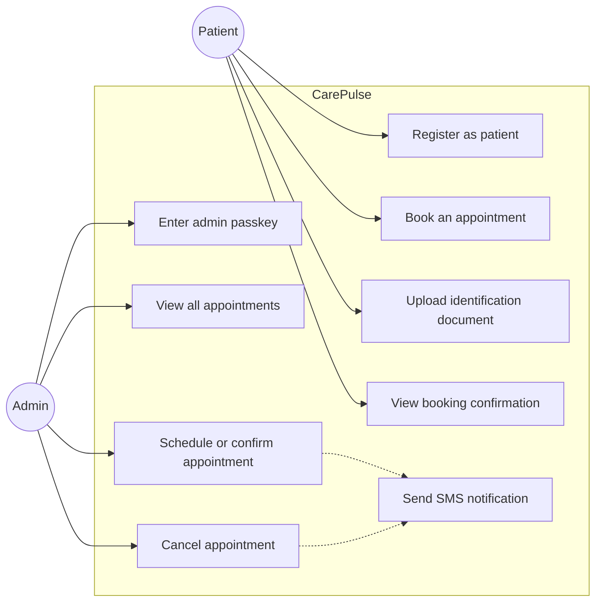
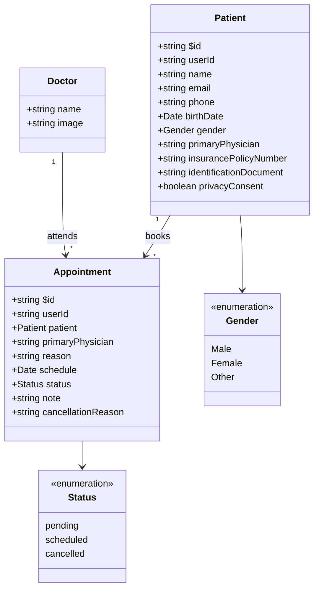
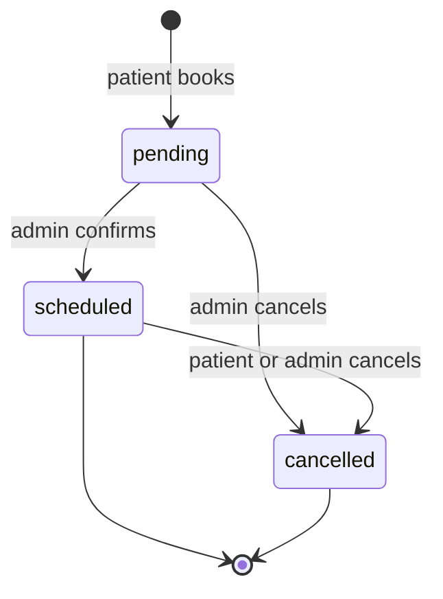
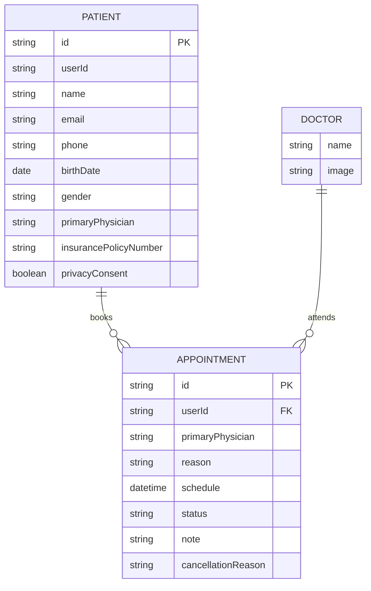
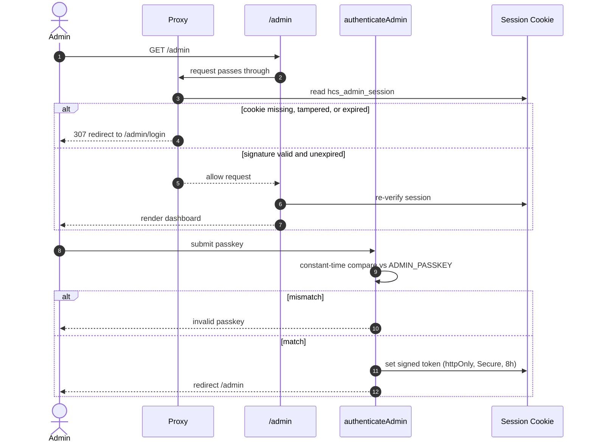
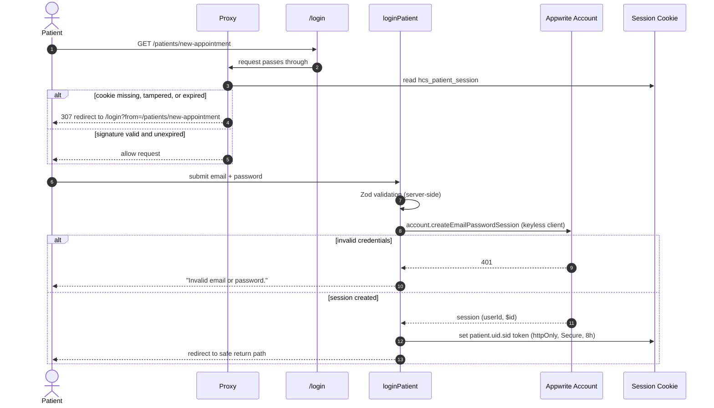
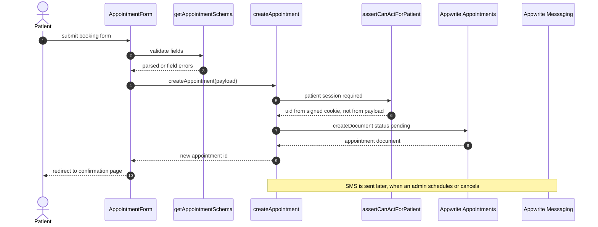
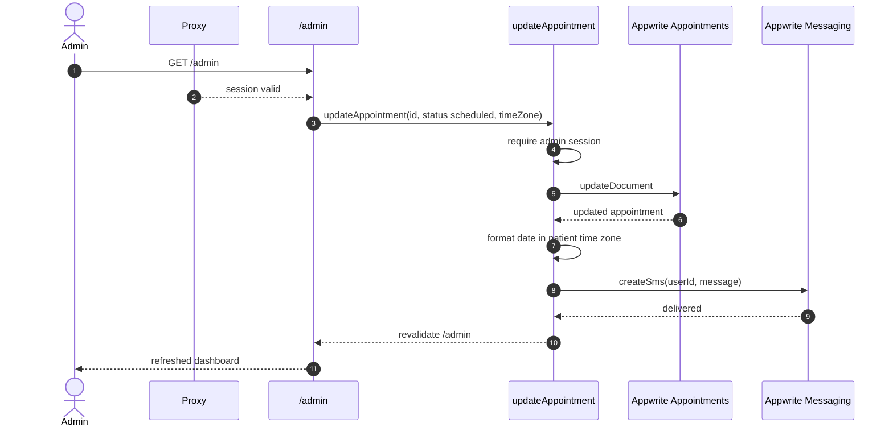

<div align="center">
  <br />
  <h3 align="center">CarePulse — A HealthCare Management System</h3>

  <div>
    
    
    
    
  </div>

  <div align="center">
      Patient registration, appointment scheduling, and an admin dashboard built with Next.js 16 and Appwrite.
    </div>

    <div align="center">
      <b>Project documentation:</b> <a href="docs/README.md">architecture</a> · <a href="docs/adr/README.md">ADR</a> · <a href="docs/openapi.yaml">API</a> · <a href="docs/security.md">security</a> · <a href="docs/environment.md">environment variables</a>
    </div>
</div>

> **Note on admin access:** the admin dashboard is gated by a server-side
> passkey (`ADMIN_PASSKEY`) and an httpOnly signed session cookie. The previous
> implementation shipped the passkey to the browser via a `NEXT_PUBLIC_` env var
> and validated it client-side, which exposed all appointment data to anyone who
> visited `/admin`. See [docs/security.md](docs/security.md) before deploying,
> and remove `NEXT_PUBLIC_ADMIN_PASSKEY` from your environment.

## 📋 <a name="table">Table of Contents</a>

1. 🤖 [Introduction](#introduction)
2. ⚙️ [Tech Stack](#tech-stack)
3. 🔋 [Features](#features)
4. 🏗️ [Architecture](#architecture)
5. 🤸 [Quick Start](#quick-start)
6. 🕸️ [Snippets (Code to Copy)](#snippets)
7. 🔗 [Assets](#links)

## <a name="introduction">🤖 Introduction</a>

A healthcare patient management application that allows patients to easily register, book, and manage their appointments with doctors, featuring administrative tools for scheduling, confirming, and canceling appointments, along with SMS notifications, all built using Next.js.

## <a name="tech-stack">⚙️ Tech Stack</a>

| Layer | Technology |
| --- | --- |
| Framework | Next.js 16 (App Router), React 19 |
| Language | TypeScript 5 (strict) |
| Styling | Tailwind CSS, shadcn/ui (Radix UI) |
| Backend | Appwrite — databases, storage, messaging |
| Forms | React Hook Form + Zod |
| Monitoring | Sentry |

> SMS delivery uses Appwrite Messaging, not the Twilio SDK.

## <a name="features">🔋 Features</a>

👉 **Register as a Patient**: Users sign up with an email and password, verified by Appwrite. Their patient record is keyed to the signed-in session, not to a URL parameter.

👉 **Book a New Appointment with Doctor**: Patients can schedule appointments with doctors at their convenience and can book multiple appointments.

👉 **Manage Appointments on Admin Side**: Administrators can efficiently view and handle all scheduled appointments.

👉 **Confirm/Schedule Appointment from Admin Side**: Admins can confirm and set appointment times to ensure they are properly scheduled.

👉 **Cancel Appointment from Admin Side**: Administrators have the ability to cancel any appointment as needed.

👉 **Send SMS on Appointment Confirmation**: Patients receive SMS notifications to confirm their appointment details.

👉 **Complete Responsiveness**: The application works seamlessly on all device types and screen sizes.

👉 **File Upload Using Appwrite Storage**: Users can upload and store files securely within the app using Appwrite storage services.

👉 **Manage and Track Application Performance Using Sentry**: The application uses Sentry to monitor and track its performance and detect any errors.

and many more, including code architecture and reusability

## <a name="architecture">🏗️ Architecture</a>

Source lives under `src/`; see [docs/architecture.md](docs/architecture.md) for the full write-up.

```text
src/
  app/          Routes (App Router), layouts, route handlers
  components/   React components (ui/ = shadcn primitives)
  lib/          Server logic: Appwrite client, actions, auth
  constants/    Shared constants
  types/        Global type declarations
  proxy.ts     Route protection
public/         Static assets
docs/           Documentation
```

The `@/*` path alias maps to `./src/*`.

### Use cases



### Class diagram



### Component diagram

```mermaid
flowchart TB
    subgraph Browser
        UI[React Components]
    end

    subgraph "Next.js Server"
        MW[Proxy - session cookie shell check]
        Pages[App Router Pages]
        Actions[Server Actions]
        Auth[Auth: guards + HMAC session]
        FeldEncrypt[PHI field encryption AES-256-GCM]
        Hydration[Batched patient hydration]
        Audit[Hash-chained audit ledger]
        SmsCron[/api/cron/sms - drains outbox]
        DocRoute[/api/documents/{fileId} - authorized stream]
        Triage[/api/ai/triage - urgency verdict]
    end

    subgraph Appwrite
        DB[(Collections: patients, appointments, doctors,\naudit_log, sms_outbox)]
        Storage[(Storage Bucket)]
        SMS[Messaging]
        Users[Users API]
    end

    subgraph External
        Scheduler[(Cron trigger - calls SmsCron with x-cron-secret)]
        Gemini[Gemini API]
    end

    UI -->|HTTP / server action| MW
    MW -->|verify session cookie| Auth
    UI -->|invoke server action| Actions
    Pages --> Actions
    Pages -->|verify session| Auth
    Actions -->|authorization check| Auth
    Actions -->|encrypt before write / decrypt on read| FeldEncrypt
    Actions -->|batch equal($id) lookups| Hydration
    Actions -->|every PHI access logged| Audit
    Actions --> DB
    Actions --> Storage
    Actions --> Users
    Actions -->|enqueueSms| DB
    SmsCron -->|drainSmsOutbox| DB
    SmsCron --> SMS
    DocRoute -->|getDocumentBytes + audit document.read| Storage
    DocRoute --> Audit
    Triage --> Gemini
    Scheduler --> SmsCron
```

### State diagram — appointment lifecycle



### Entity relationship diagram



### Sequence diagram — admin authentication



### Sequence diagram — patient authentication



### Sequence diagram — booking an appointment



### Sequence diagram — admin schedules and notifies



> ⚠️ The `timeZone` sent from the client is **not** trusted — it originates in the
> browser. It is validated as a real IANA zone and used only to format the SMS,
> never to gate anything. See [docs/security.md](docs/security.md).

## <a name="quick-start">🤸 Quick Start</a>

Follow these steps to set up the project locally on your machine.

**Prerequisites**

Make sure you have the following installed on your machine:

- [Git](https://git-scm.com/)
- [Node.js](https://nodejs.org/en)
- [npm](https://www.npmjs.com/) (Node Package Manager)

**Cloning the Repository**

```bash
git clone https://github.com/ogc16/healthcaresystem.git
cd healthcare
```

**Installation**

Install the project dependencies using npm:

```bash
npm install
```

**Set Up Environment Variables**

Create a new file named `.env.local` in the root of your project and add the following content:

```env
#APPWRITE
NEXT_PUBLIC_ENDPOINT=https://cloud.appwrite.io/v1
PROJECT_ID=
API_KEY=
DATABASE_ID=
PATIENT_COLLECTION_ID=
DOCTOR_COLLECTION_ID=
APPOINTMENT_COLLECTION_ID=
NEXT_PUBLIC_BUCKET_ID=

#ADMIN — server-side only, never prefix these with NEXT_PUBLIC_
ADMIN_PASSKEY=
SESSION_SECRET=
```

Replace the placeholder values with your actual Appwrite credentials. You can obtain these credentials by signing up on the [Appwrite website](https://appwrite.io/).

`ADMIN_PASSKEY` and `SESSION_SECRET` gate the admin dashboard and must **not** use the `NEXT_PUBLIC_` prefix — that would publish them to every visitor. See [docs/environment.md](docs/environment.md) and [docs/security.md](docs/security.md).

**Running the Project**

```bash
npm run dev
```

Open [http://localhost:3000](http://localhost:3000) in your browser to view the project.

## <a name="snippets">🕸️ Snippets</a>

<details>
<summary><code>tailwind.config.ts</code></summary>

```typescript
import type { Config } from "tailwindcss";

const { fontFamily } = require("tailwindcss/defaultTheme");

const config = {
  darkMode: ["class"],
  content: [
    "./pages/**/*.{ts,tsx}",
    "./components/**/*.{ts,tsx}",
    "./app/**/*.{ts,tsx}",
    "./src/**/*.{ts,tsx}",
  ],
  prefix: "",
  theme: {
    container: {
      center: true,
      padding: "2rem",
      screens: {
        "2xl": "1400px",
      },
    },
    extend: {
      colors: {
        green: {
          500: "#24AE7C",
          600: "#0D2A1F",
        },
        blue: {
          500: "#79B5EC",
          600: "#152432",
        },
        red: {
          500: "#F37877",
          600: "#3E1716",
          700: "#F24E43",
        },
        light: {
          200: "#E8E9E9",
        },
        dark: {
          200: "#0D0F10",
          300: "#131619",
          400: "#1A1D21",
          500: "#363A3D",
          600: "#76828D",
          700: "#ABB8C4",
        },
      },
      fontFamily: {
        sans: ["var(--font-sans)", ...fontFamily.sans],
      },
      backgroundImage: {
        appointments: "url('/assets/images/appointments-bg.png')",
        pending: "url('/assets/images/pending-bg.png')",
        cancelled: "url('/assets/images/cancelled-bg.png')",
      },
      keyframes: {
        "accordion-down": {
          from: { height: "0" },
          to: { height: "var(--radix-accordion-content-height)" },
        },
        "accordion-up": {
          from: { height: "var(--radix-accordion-content-height)" },
          to: { height: "0" },
        },
        "caret-blink": {
          "0%,70%,100%": { opacity: "1" },
          "20%,50%": { opacity: "0" },
        },
      },
      animation: {
        "accordion-down": "accordion-down 0.2s ease-out",
        "accordion-up": "accordion-up 0.2s ease-out",
        "caret-blink": "caret-blink 1.25s ease-out infinite",
      },
    },
  },
  plugins: [require("tailwindcss-animate")],
} satisfies Config;

export default config;
```

</details>

<details>
<summary><code>src/app/globals.css</code></summary>

```css
@tailwind base;
@tailwind components;
@tailwind utilities;

/* ========================================== TAILWIND STYLES */
@layer base {
  /* Remove scrollbar */
  .remove-scrollbar::-webkit-scrollbar {
    width: 0px;
    height: 0px;
    border-radius: 0px;
  }

  .remove-scrollbar::-webkit-scrollbar-track {
    background: transparent;
  }

  .remove-scrollbar::-webkit-scrollbar-thumb {
    background: transparent;
    border-radius: 0px;
  }

  .remove-scrollbar::-webkit-scrollbar-thumb:hover {
    /* background: #1e2238; */
    background: transparent;
  }
}

@layer utilities {
  /* ===== UTILITIES */
  .sidebar {
    @apply remove-scrollbar w-full max-w-72 flex-col overflow-auto bg-black-800 px-7 py-10;
  }

  .left-sidebar {
    @apply hidden lg:flex;
  }

  .right-sidebar {
    @apply hidden xl:flex;
  }

  .clip-text {
    @apply bg-clip-text text-transparent;
  }

  .bg-image {
    @apply bg-black-900 bg-light-rays bg-cover bg-no-repeat;
  }

  .header {
    @apply text-32-bold md:text-36-bold;
  }

  .sub-header {
    @apply text-18-bold md:text-24-bold;
  }

  .container {
    @apply relative flex-1 overflow-y-auto px-[5%];
  }

  .sub-container {
    @apply mx-auto flex size-full flex-col py-10;
  }

  .side-img {
    @apply hidden h-full object-cover md:block;
  }

  .copyright {
    @apply text-14-regular justify-items-end text-center text-dark-600 xl:text-left;
  }

  /* ==== SUCCESS */
  .success-img {
    @apply m-auto flex flex-1 flex-col items-center justify-between gap-10 py-10;
  }

  .request-details {
    @apply flex w-full flex-col items-center gap-8 border-y-2 border-dark-400 py-8 md:w-fit md:flex-row;
  }

  /* ===== ADMIN */
  .admin-header {
    @apply sticky top-3 z-20 mx-3 flex items-center justify-between rounded-2xl bg-dark-200 px-[5%] py-5 shadow-lg xl:px-12;
  }

  .admin-main {
    @apply flex flex-col items-center space-y-6 px-[5%] pb-12 xl:space-y-12 xl:px-12;
  }

  .admin-stat {
    @apply flex w-full flex-col justify-between gap-5 sm:flex-row xl:gap-10;
  }

  /* ==== FORM */
  .radio-group {
    @apply flex h-full flex-1 items-center gap-2 rounded-md border border-dashed border-dark-500 bg-dark-400 p-3;
  }

  .checkbox-label {
    @apply cursor-pointer text-sm font-medium text-dark-700 peer-disabled:cursor-not-allowed peer-disabled:opacity-70 md:leading-none;
  }

  /* ==== File Upload */
  .file-upload {
    @apply text-12-regular flex cursor-pointer  flex-col items-center justify-center gap-3 rounded-md border border-dashed border-dark-500 bg-dark-400 p-5;
  }

  .file-upload_label {
    @apply flex flex-col justify-center gap-2 text-center text-dark-600;
  }

  /* ==== Stat Card */
  .stat-card {
    @apply flex flex-1 flex-col gap-6 rounded-2xl bg-cover p-6 shadow-lg;
  }

  /* ==== Status Badge */
  .status-badge {
    @apply flex w-fit items-center gap-2 rounded-full px-4 py-2;
  }

  /* Data Table */
  .data-table {
    @apply z-10 w-full overflow-hidden rounded-lg border border-dark-400 shadow-lg;
  }

  .table-actions {
    @apply flex w-full items-center justify-between space-x-2 p-4;
  }

  /* ===== ALIGNMENTS */
  .flex-center {
    @apply flex items-center justify-center;
  }

  .flex-between {
    @apply flex items-center justify-between;
  }

  /* ===== TYPOGRAPHY */
  .text-36-bold {
    @apply text-[36px] leading-[40px] font-bold;
  }

  .text-24-bold {
    @apply text-[24px] leading-[28px] font-bold;
  }

  .text-32-bold {
    @apply text-[32px] leading-[36px] font-bold;
  }

  .text-18-bold {
    @apply text-[18px] leading-[24px] font-bold;
  }

  .text-16-semibold {
    @apply text-[16px] leading-[20px] font-semibold;
  }

  .text-16-regular {
    @apply text-[16px] leading-[20px] font-normal;
  }

  .text-14-medium {
    @apply text-[14px] leading-[18px] font-medium;
  }

  .text-14-regular {
    @apply text-[14px] leading-[18px] font-normal;
  }

  .text-12-regular {
    @apply text-[12px] leading-[16px] font-normal;
  }

  .text-12-semibold {
    @apply text-[12px] leading-[16px] font-semibold;
  }

  /* =====  SHADCN OVERRIDES */
  .shad-primary-btn {
    @apply bg-green-500 text-white !important;
  }

  .shad-danger-btn {
    @apply bg-red-700 text-white !important;
  }

  .shad-gray-btn {
    @apply border border-dark-500 cursor-pointer bg-dark-400 text-white !important;
  }

  .shad-input-label {
    @apply text-14-medium text-dark-700 !important;
  }

  .shad-input {
    @apply bg-dark-400 placeholder:text-dark-600 border-dark-500 h-11 focus-visible:ring-0 focus-visible:ring-offset-0 !important;
  }

  .shad-input-icon {
    @apply bg-dark-400 placeholder:text-dark-600 border-dark-500 h-11 focus-visible:ring-0 focus-visible:ring-offset-0 !important;
  }

  .shad-textArea {
    @apply bg-dark-400 placeholder:text-dark-600 border-dark-500 focus-visible:ring-0 focus-visible:ring-offset-0 !important;
  }

  .shad-combobox-item {
    @apply data-[disabled=true]:pointer-events-none data-[disabled=true]:opacity-50 !important;
  }

  .shad-combobox-trigger {
    @apply h-11 !important;
  }

  .shad-select-trigger {
    @apply bg-dark-400  placeholder:text-dark-600 border-dark-500 h-11 focus:ring-0 focus:ring-offset-0 !important;
  }

  .shad-select-content {
    @apply bg-dark-400 border-dark-500 !important;
  }

  .shad-dialog {
    @apply bg-dark-400 border-dark-500 !important;
  }

  .shad-dialog button {
    @apply focus:ring-0 focus:ring-offset-0 focus-visible:border-none focus-visible:outline-none focus-visible:ring-transparent focus-visible:ring-offset-0 !important;
  }

  .shad-error {
    @apply text-red-400 !important;
  }

  .shad-table {
    @apply rounded-lg overflow-hidden !important;
  }

  .shad-table-row-header {
    @apply border-b border-dark-400 text-light-200 hover:bg-transparent !important;
  }

  .shad-table-row {
    @apply border-b border-dark-400 text-light-200 !important;
  }

  .shad-otp {
    @apply w-full flex justify-between !important;
  }

  .shad-otp-slot {
    @apply text-36-bold justify-center flex border border-dark-500 rounded-lg size-16 gap-4 !important;
  }

  .shad-alert-dialog {
    @apply space-y-5 bg-dark-400 border-dark-500 outline-none !important;
  }

  .shad-sheet-content button {
    @apply top-2 focus:ring-0 focus:ring-offset-0 focus-visible:border-none focus-visible:outline-none focus-visible:ring-transparent focus-visible:ring-offset-0 !important;
  }

  /* =====  REACT PHONE NUMBER INPUT OVERRIDES */
  .input-phone {
    @apply mt-2 h-11 rounded-md px-3 text-sm border bg-dark-400 placeholder:text-dark-600 border-dark-500 !important;
  }

  /* =====  REACT DATE PICKER OVERRIDES */
  .date-picker {
    @apply overflow-hidden border-transparent w-full placeholder:text-dark-600  h-11 text-14-medium rounded-md px-3 outline-none !important;
  }
}

/* =====  REACT-DATEPICKER OVERRIDES */
.react-datepicker-wrapper.date-picker {
  display: flex;
  align-items: center;
}

.react-datepicker,
.react-datepicker__time,
.react-datepicker__header,
.react-datepicker__current-month,
.react-datepicker__day-name,
.react-datepicker__day,
.react-datepicker-time__header {
  background-color: #1a1d21 !important;
  border-color: #363a3d !important;
  color: #abb8c4 !important;
}

.react-datepicker__current-month,
.react-datepicker__day-name,
.react-datepicker-time__header {
  color: #ffffff !important;
}

.react-datepicker__triangle {
  fill: #1a1d21 !important;
  color: #1a1d21 !important;
  stroke: #1a1d21 !important;
}

.react-datepicker__time-list-item:hover {
  background-color: #363a3d !important;
}

.react-datepicker__input-container input {
  background-color: #1a1d21 !important;
  width: 100%;
  outline: none;
}

.react-datepicker__day--selected {
  background-color: #24ae7c !important;
  color: #ffffff !important;
  border-radius: 4px;
}

.react-datepicker__time-list-item--selected {
  background-color: #24ae7c !important;
}

.react-datepicker__time-container {
  border-left: 1px solid #363a3d !important;
}

.react-datepicker__time-list-item {
  display: flex !important;
  align-items: center !important;
}

/* =====  REACT PHONE NUMBER INPUT OVERRIDES */
.PhoneInputInput {
  outline: none;
  margin-left: 4px;
  background: #1a1d21;
  font-size: 14px;
  font-weight: 500;
}

.PhoneInputInput::placeholder {
  color: #1a1d21;
}
```

</details>

<details>
<summary><code>src/types/index.d.ts</code></summary>

```typescript
/* eslint-disable no-unused-vars */

declare type SearchParamProps = {
  params: { [key: string]: string };
  searchParams: { [key: string]: string | string[] | undefined };
};

declare type Gender = "Male" | "Female" | "Other";
declare type Status = "pending" | "scheduled" | "cancelled";

declare interface CreateUserParams {
  name: string;
  email: string;
  phone: string;
  password: string;
}
declare interface User extends CreateUserParams {
  $id: string;
}

// No userId: the server takes the subject from the signed session, so there is
// nothing for a caller to tamper with.
declare interface RegisterUserParams extends CreateUserParams {
  birthDate: Date;
  gender: Gender;
  address: string;
  occupation: string;
  emergencyContactName: string;
  emergencyContactNumber: string;
  primaryPhysician: string;
  insuranceProvider: string;
  insurancePolicyNumber: string;
  allergies: string | undefined;
  currentMedication: string | undefined;
  familyMedicalHistory: string | undefined;
  pastMedicalHistory: string | undefined;
  identificationType: string | undefined;
  identificationNumber: string | undefined;
  identificationDocument: FormData | undefined;
  privacyConsent: boolean;
}

declare type CreateAppointmentParams = {
  userId: string;
  patient: string;
  primaryPhysician: string;
  reason: string;
  schedule: Date;
  status: Status;
  note: string | undefined;
};

declare type UpdateAppointmentParams = {
  appointmentId: string;
  appointment: Appointment;
  type: string;
  timeZone: string;
};
```

</details>

<details>
<summary><code>src/types/appwrite.types.ts</code></summary>

```typescript
import { Models } from "node-appwrite";

export interface Patient extends Models.Document {
  userId: string;
  name: string;
  email: string;
  phone: string;
  birthDate: Date;
  gender: Gender;
  address: string;
  occupation: string;
  emergencyContactName: string;
  emergencyContactNumber: string;
  primaryPhysician: string;
  insuranceProvider: string;
  insurancePolicyNumber: string;
  allergies: string | undefined;
  currentMedication: string | undefined;
  familyMedicalHistory: string | undefined;
  pastMedicalHistory: string | undefined;
  identificationType: string | undefined;
  identificationNumber: string | undefined;
  identificationDocument: FormData | undefined;
  privacyConsent: boolean;
}

export interface Appointment extends Models.Document {
  patient: Patient;
  schedule: Date;
  status: Status;
  primaryPhysician: string;
  reason: string;
  note: string;
  userId: string;
  cancellationReason: string | null;
}
```

</details>

<details>
<summary><code>src/lib/utils.ts</code></summary>

```typescript
import { type ClassValue, clsx } from "clsx";
import { twMerge } from "tailwind-merge";

export function cn(...inputs: ClassValue[]) {
  return twMerge(clsx(inputs));
}

export const parseStringify = (value: any) => JSON.parse(JSON.stringify(value));

export const convertFileToUrl = (file: File) => URL.createObjectURL(file);

// FORMAT DATE TIME
export const formatDateTime = (dateString: Date | string) => {
  const dateTimeOptions: Intl.DateTimeFormatOptions = {
    // weekday: "short", // abbreviated weekday name (e.g., 'Mon')
    month: "short", // abbreviated month name (e.g., 'Oct')
    day: "numeric", // numeric day of the month (e.g., '25')
    year: "numeric", // numeric year (e.g., '2023')
    hour: "numeric", // numeric hour (e.g., '8')
    minute: "numeric", // numeric minute (e.g., '30')
    hour12: true, // use 12-hour clock (true) or 24-hour clock (false)
  };

  const dateDayOptions: Intl.DateTimeFormatOptions = {
    weekday: "short", // abbreviated weekday name (e.g., 'Mon')
    year: "numeric", // numeric year (e.g., '2023')
    month: "2-digit", // abbreviated month name (e.g., 'Oct')
    day: "2-digit", // numeric day of the month (e.g., '25')
  };

  const dateOptions: Intl.DateTimeFormatOptions = {
    month: "short", // abbreviated month name (e.g., 'Oct')
    year: "numeric", // numeric year (e.g., '2023')
    day: "numeric", // numeric day of the month (e.g., '25')
  };

  const timeOptions: Intl.DateTimeFormatOptions = {
    hour: "numeric", // numeric hour (e.g., '8')
    minute: "numeric", // numeric minute (e.g., '30')
    hour12: true, // use 12-hour clock (true) or 24-hour clock (false)
  };

  const formattedDateTime: string = new Date(dateString).toLocaleString(
    "en-US",
    dateTimeOptions
  );

  const formattedDateDay: string = new Date(dateString).toLocaleString(
    "en-US",
    dateDayOptions
  );

  const formattedDate: string = new Date(dateString).toLocaleString(
    "en-US",
    dateOptions
  );

  const formattedTime: string = new Date(dateString).toLocaleString(
    "en-US",
    timeOptions
  );

  return {
    dateTime: formattedDateTime,
    dateDay: formattedDateDay,
    dateOnly: formattedDate,
    timeOnly: formattedTime,
  };
};
```

</details>

<details>
<summary><code>src/lib/validation.ts</code></summary>

```typescript
import { z } from "zod";

export const UserFormValidation = z
  .object({
    name: z
      .string()
      .min(2, "Name must be at least 2 characters")
      .max(50, "Name must be at most 50 characters"),
    email: z.string().email("Invalid email address"),
    phone: z
      .string()
      .refine((phone) => /^\d{10,15}$/.test(phone), "Invalid phone number"),
    password: z
      .string()
      .min(8, "Password must be at least 8 characters")
      .max(128, "Password must be at most 128 characters"),
    confirmPassword: z.string().min(1, "Confirm your password"),
  })
  .refine((values) => values.password === values.confirmPassword, {
    message: "Passwords do not match",
    path: ["confirmPassword"],
  });

export const LoginSchema = z.object({
  email: z.string().email("Invalid email address"),
  password: z.string().min(1, "Password is required"),
});

export const PatientFormValidation = z.object({
  name: z
    .string()
    .min(2, "Name must be at least 2 characters")
    .max(50, "Name must be at most 50 characters"),
  email: z.string().email("Invalid email address"),
  phone: z
    .string()
    .refine((phone) => /^\+\d{10,15}$/.test(phone), "Invalid phone number"),
  birthDate: z.coerce.date(),
  gender: z.enum(["Male", "Female", "Other"]),
  address: z
    .string()
    .min(5, "Address must be at least 5 characters")
    .max(500, "Address must be at most 500 characters"),
  occupation: z
    .string()
    .min(2, "Occupation must be at least 2 characters")
    .max(500, "Occupation must be at most 500 characters"),
  emergencyContactName: z
    .string()
    .min(2, "Contact name must be at least 2 characters")
    .max(50, "Contact name must be at most 50 characters"),
  emergencyContactNumber: z
    .string()
    .refine(
      (emergencyContactNumber) => /^\+\d{10,15}$/.test(emergencyContactNumber),
      "Invalid phone number"
    ),
  primaryPhysician: z.string().min(2, "Select at least one doctor"),
  insuranceProvider: z
    .string()
    .min(2, "Insurance name must be at least 2 characters")
    .max(50, "Insurance name must be at most 50 characters"),
  insurancePolicyNumber: z
    .string()
    .min(2, "Policy number must be at least 2 characters")
    .max(50, "Policy number must be at most 50 characters"),
  allergies: z.string().optional(),
  currentMedication: z.string().optional(),
  familyMedicalHistory: z.string().optional(),
  pastMedicalHistory: z.string().optional(),
  identificationType: z.string().optional(),
  identificationNumber: z.string().optional(),
  identificationDocument: z.custom<File[]>().optional(),
  treatmentConsent: z
    .boolean()
    .default(false)
    .refine((value) => value === true, {
      message: "You must consent to treatment in order to proceed",
    }),
  disclosureConsent: z
    .boolean()
    .default(false)
    .refine((value) => value === true, {
      message: "You must consent to disclosure in order to proceed",
    }),
  privacyConsent: z
    .boolean()
    .default(false)
    .refine((value) => value === true, {
      message: "You must consent to privacy in order to proceed",
    }),
});

export const CreateAppointmentSchema = z.object({
  primaryPhysician: z.string().min(2, "Select at least one doctor"),
  schedule: z.coerce.date(),
  reason: z
    .string()
    .min(2, "Reason must be at least 2 characters")
    .max(500, "Reason must be at most 500 characters"),
  note: z.string().optional(),
  cancellationReason: z.string().optional(),
});

export const ScheduleAppointmentSchema = z.object({
  primaryPhysician: z.string().min(2, "Select at least one doctor"),
  schedule: z.coerce.date(),
  reason: z.string().optional(),
  note: z.string().optional(),
  cancellationReason: z.string().optional(),
});

export const CancelAppointmentSchema = z.object({
  primaryPhysician: z.string().min(2, "Select at least one doctor"),
  schedule: z.coerce.date(),
  reason: z.string().optional(),
  note: z.string().optional(),
  cancellationReason: z
    .string()
    .min(2, "Reason must be at least 2 characters")
    .max(500, "Reason must be at most 500 characters"),
});

export function getAppointmentSchema(type: string) {
  switch (type) {
    case "create":
      return CreateAppointmentSchema;
    case "cancel":
      return CancelAppointmentSchema;
    default:
      return ScheduleAppointmentSchema;
  }
}
```

</details>

<details>
<summary><code>src/constants/index.ts</code></summary>

```typescript
export const GenderOptions = ["Male", "Female", "Other"];

export const PatientFormDefaultValues = {
  firstName: "",
  lastName: "",
  email: "",
  phone: "",
  birthDate: new Date(Date.now()),
  gender: "Male" as Gender,
  address: "",
  occupation: "",
  emergencyContactName: "",
  emergencyContactNumber: "",
  primaryPhysician: "",
  insuranceProvider: "",
  insurancePolicyNumber: "",
  allergies: "",
  currentMedication: "",
  familyMedicalHistory: "",
  pastMedicalHistory: "",
  identificationType: "Birth Certificate",
  identificationNumber: "",
  identificationDocument: [],
  treatmentConsent: false,
  disclosureConsent: false,
  privacyConsent: false,
};

export const IdentificationTypes = [
  "Birth Certificate",
  "Driver's License",
  "Medical Insurance Card/Policy",
  "Military ID Card",
  "National Identity Card",
  "Passport",
  "Resident Alien Card (Green Card)",
  "Social Security Card",
  "State ID Card",
  "Student ID Card",
  "Voter ID Card",
];

export const Doctors = [
  {
    image: "/assets/images/dr-green.png",
    name: "John Green",
  },
  {
    image: "/assets/images/dr-cameron.png",
    name: "Leila Cameron",
  },
  {
    image: "/assets/images/dr-livingston.png",
    name: "David Livingston",
  },
  {
    image: "/assets/images/dr-peter.png",
    name: "Evan Peter",
  },
  {
    image: "/assets/images/dr-powell.png",
    name: "Jane Powell",
  },
  {
    image: "/assets/images/dr-remirez.png",
    name: "Alex Ramirez",
  },
  {
    image: "/assets/images/dr-lee.png",
    name: "Jasmine Lee",
  },
  {
    image: "/assets/images/dr-cruz.png",
    name: "Alyana Cruz",
  },
  {
    image: "/assets/images/dr-sharma.png",
    name: "Hardik Sharma",
  },
];

export const StatusIcon = {
  scheduled: "/assets/icons/check.svg",
  pending: "/assets/icons/pending.svg",
  cancelled: "/assets/icons/cancelled.svg",
};
```

</details>

## <a name="links">🔗 Assets</a>

All public assets are committed under `public/assets/` — icons in `public/assets/icons/`, images in `public/assets/images/`.

## <a name="contributing">🤝 Contributing</a>

Issues and pull requests are welcome. For security reports, see [docs/security.md](docs/security.md).
